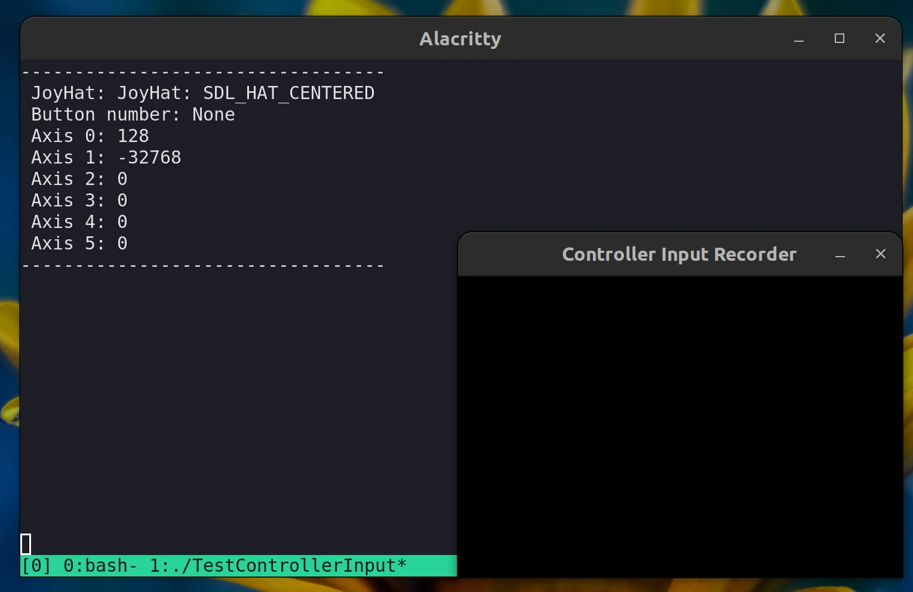

# test_game_controller_input


## About
CLI program to get JoyStick input information

## Dependencies
* gcc (GNU GCC Compiler)
	* build-essential (Debian and Ubuntu distros and its derivatives)
* libsdl2-dev
* libsdl2-mixer-dev
* libsld2-image-dev
* cmake

## Manual Install (Ubuntu 22.04.2 LTS)
[manual_install_sdl2](./manual_install_sdl2.md)

## Building the project
Go the root of my repository
```
cd minimal-2d-platformer-sdl2
```

Set up the build directory
```
cmake -B build
```

Go to build directory
```
cd build
```

Compile the project
```
cmake --build .
```

## Setup Editor for VSCode
Go to `~/.config/Code/User/settings.json`
Add this line if it does not exist
```
"C_Cpp.clang_format_fallbackStyle": "{ BaseOnStyle: Google, IndentWidth: 4, TabWidth: 4 }"
```
